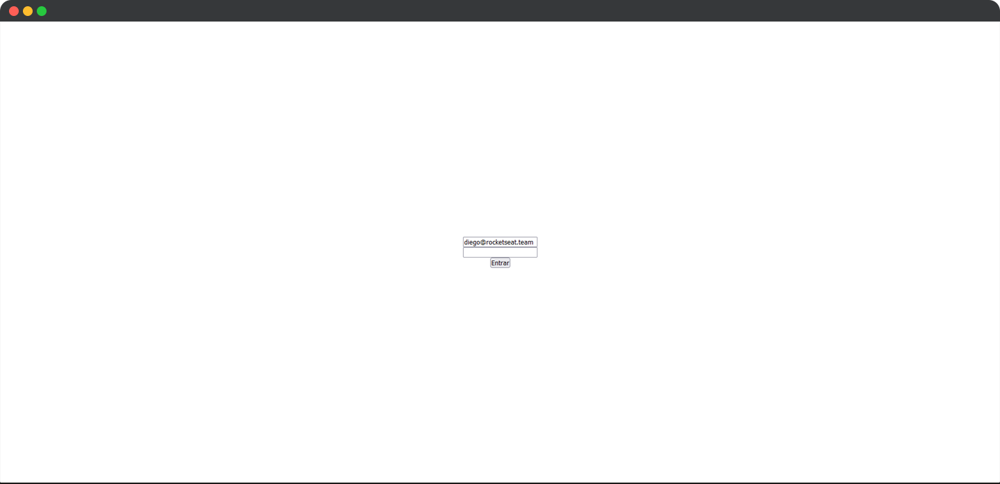

<h1 align="center">
  NextAuth
</h1>

<p align="center">
  

  
</p>

<br>

<p align="center">
  
</p>

<br>

## 🧪 Tecnologias

Esse projeto foi desenvolvido com as seguintes tecnologias:

- [React](https://reactjs.org)
- [NextJS](https://nextjs.org/)
- [Nookies](https://github.com/maticzav/nookies)
- [NodeJS](https://nodejs.org/en/)
- [jsonwebtoken](https://github.com/auth0/node-jsonwebtoken)
- [TypeScript](https://www.typescriptlang.org/)

## 💻 Projeto

O projeto tem como objetivo o estudo e desenvolvimento de uma aplicação em NextJS para autenticação e controle de permissões de acesso.

NextAuth foi desenvolvido utilizando o framework NextJS aplicando o fluxo de autenticação utilizando contextAPI e cookies. O fluxo de autenticação e os controles de permissões de acesso é aplicado tanto do lado do servidor (Server-side) quanto do lado do cliente (Client-side).

Este é um projeto desenvolvido como prática das aulas do Chapter IV da trilha ReactJS do **[Programa Ignite](https://www.rocketseat.com.br/ignite)** da Rocketseat.

## 🚀 Como executar

Clone o projeto e acesse a pasta do mesmo.

```bash
$ git clone https://github.com/rafaelramosdev/nextauth
$ cd nextauth
```

A aplicação é dividida em duas partes: web e api, a versão web precisa que a api esteja sendo executada para funcionar. Para iniciá-los, siga os passos abaixo:

## Rodando a versão api

```bash
# Entra na pasta da api
$ cd api

# Instala as dependências
$ yarn

# Inicia a api
$ yarn dev
```

A api estará ouvindo a porta 3333 e estará disponível no endereço [`http://localhost:3333`](http://localhost:3333)

## Rodando a versão web

```bash
# Entra na pasta do website
$ cd web

# Instala as dependências
$ yarn

# Inicia o website
$ yarn dev
```

O website estará disponível no seu navegador pelo endereço [`http://localhost:3000`](http://localhost:3000).

## 📄 Licença

Esse projeto está sob a licença MIT. Veja o arquivo [LICENSE](LICENSE) para mais detalhes.

---

Feito by [Rafael Ramos](https://rafaelramos.dev/) 🙋🏻‍♂️
